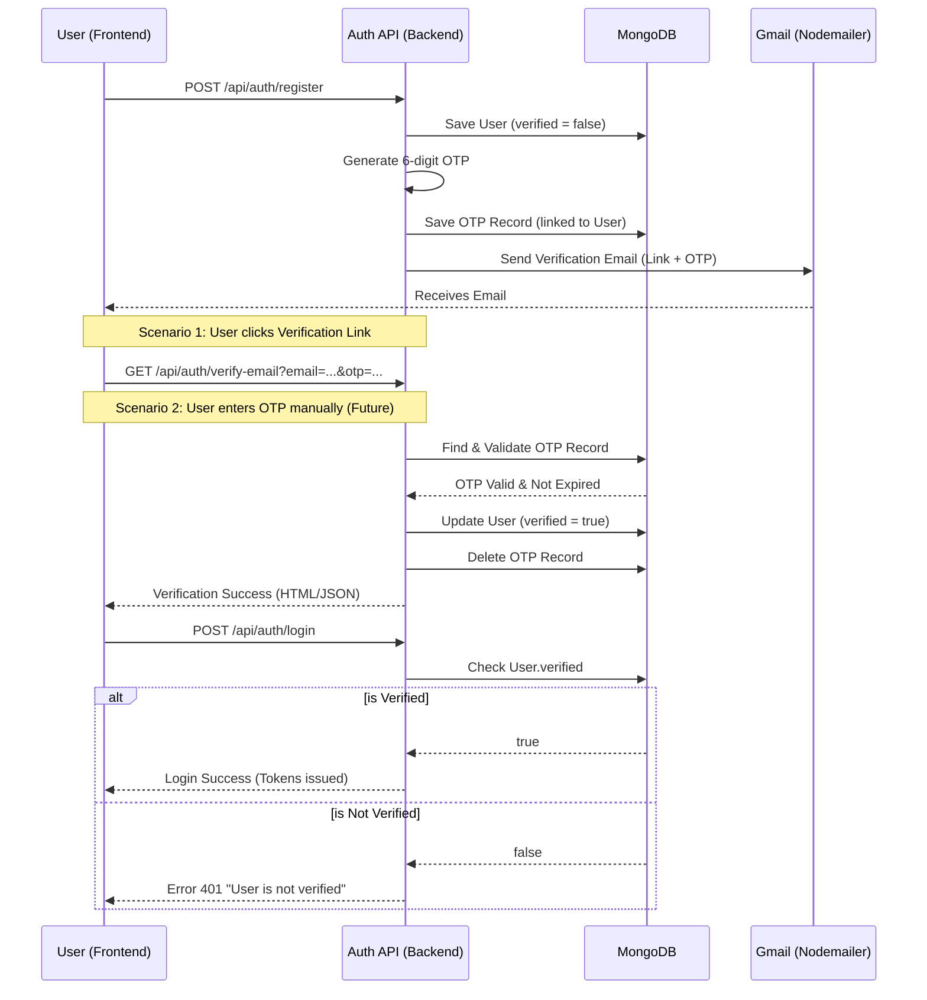

# 🛡️ OTP Authentication & Email Verification Flow

This document details the implementation of the OTP (One-Time Password) system and the email verification workflow added to the Auth Backend.

## 🚀 Overview
To enhance security, we now require users to verify their email addresses immediately after registration. Users are restricted from logging in until they have successfully verified their email through a link or OTP code sent to their registered email address.

---

## 📊 Process Flow Diagram

---

## 📂 Code Roadmap (File References)

### 1. Utility Functions
- **File:** `src/utils/utils.js`
- **`generateOtp()`**: (Lines 1-3) Generates a random 6-digit number.
- **`genrateHtmlOtp()`**: (Lines 5-39) Creates the professional email template with verification link and OTP.

### 2. OTP Database Model
- **File:** `src/model/otp.model.js`
- Defines the temporary storage for OTPs, including a reference to the `User` and `email`.
- **Expiry Logic**: (Calculated in `verifyEmail` controller) Checks if the record is older than **10 minutes**.

### 3. Auth Controller (Core Logic)
- **File:** `src/controller/auth.controller.js`
- **`register`** (Lines 32-80): Orchestrates User creation, OTP generation, DB storage, and email dispatch.
- **`login`** (Lines 100-104): Implements the gatekeeper check for `user.verified`.
- **`verifyEmail`** (Lines 350-415): Handles the incoming verification request, validates the OTP, updates the user state, and cleans up the OTP record.

### 4. Routes
- **File:** `src/routes/auth.routes.js`
- **`router.get("/verify-email", ...)`**: (Added) Endpoint for email link verification.

---

## 🔒 Security Best Practices Implemented
1.  **Strict Gatekeeping**: Login is blocked until `verified` is explicitly set to `true`.
2.  **One-Time Use**: OTP records are deleted immediately after use to prevent replay attacks.
3.  **Expiration Window**: OTPs are valid for only 10 minutes.
4.  **Decoupled Schema**: Using a separate `Otp` collection prevents cluttering the `users` table with temporary data.

---

## 🛠️ Testing the Flow
1.  Register a user via Postman: `POST /api/auth/register`.
2.  Check the server console or your email inbox for the verification link.
3.  Attempt a login: `POST /api/auth/login`. (Should fail with "User not verified").
4.  Visit the verification link (manually or by clicking).
5.  Attempt login again. (Should succeed).
